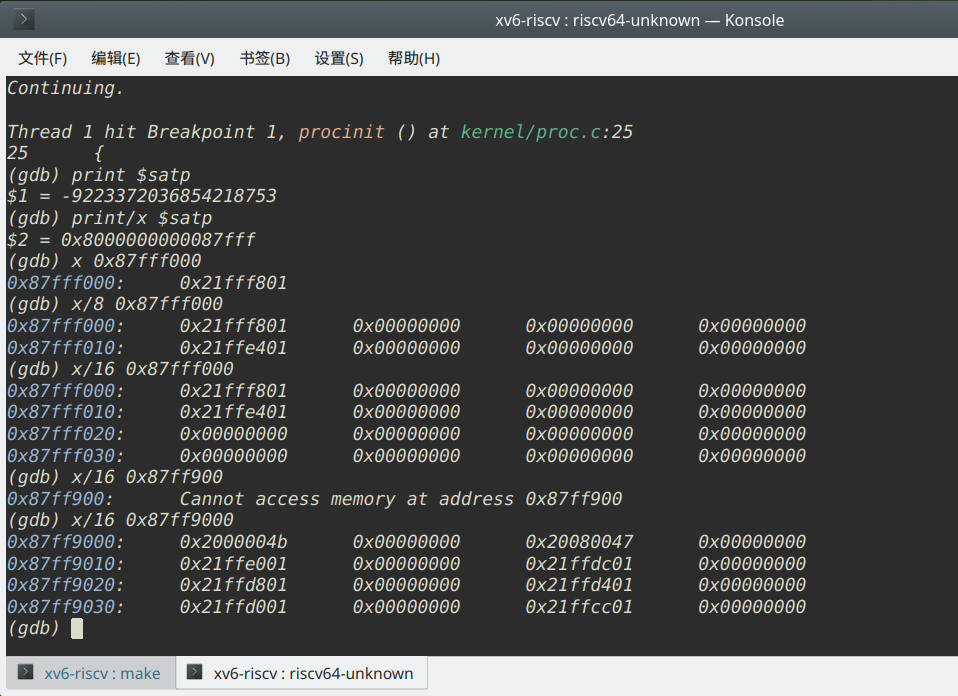

# ch3 - Exercise

## 1. what is RISC-V's device tree?
TODO

## 2. write sbrk to investigate page table
just refer *sbrk.c*

## 3. Modify xv6 to use super pages for the kernel.
Basically, we create a page table entry in level-1 page table, instead of level-0,  
then we have 9-bit longer address, which forms **2-megabtye** page now.

steps:
1. In *kernel.ld*: change `etext` to align with a super page, i.e., **2 megabyte**
2. In *kalloc.c*: freerange's `end` should align with a super page too (In *riscv.h*: add `SPGSIZE` macro)
3. In *vm.c*: add `kvmsmap`, `mapspages` and `swalk` (In *defs.h*: add relevant declaration)

view page table, breakpoint at procinit():
