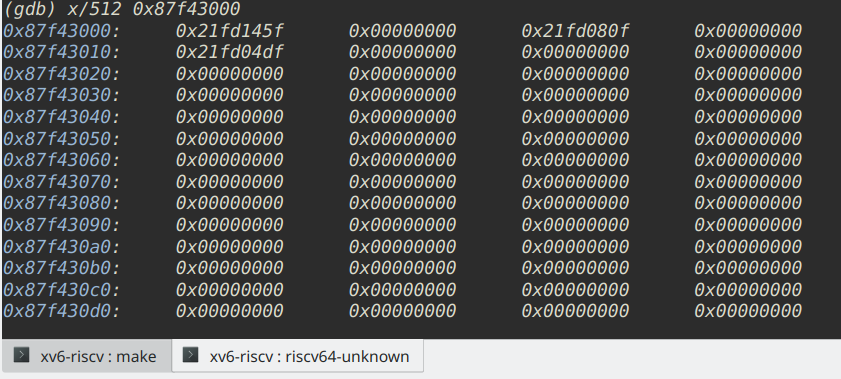
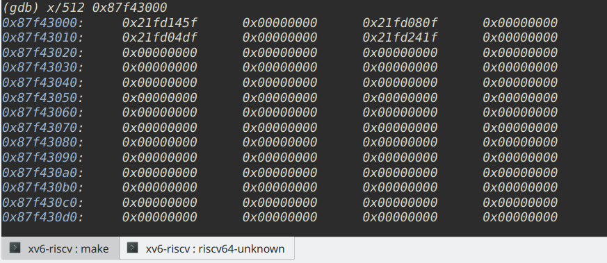

# Lec Record
## lec4 - Isolation & system call entry/exit
### address shift problem  
In xv6 book, section 2.8 Exercises have something different in my computer.  
i.e., address `0x3ffffff07e` become `0x3ffffff10e` in my computer actually.  
Troubleshooting:  
break at `0x3ffffff07e`, and then  
use gdb to `disas` a certain range of instructions, for example, `disas 0x3ffffff07e, 0x3fffffffff`

### write() start at ?
In lec notes, it says in sh.asm `write()` starts at address `0xd68`.  
In my computer, `write()` starts at address `0xd6a`.  
`ret`'s pc: `now we're back in the user program (pc = 0xd6e)`.  
In my computer, should be `0xd70`.

### **GOTCHA**  
In the lec note, `gdb has already executed this instruction (I don't know why)`  
This instruction is `csrrw a0, sscratch, a0`, first line in *uservec* of *kernel/trampoline.S* 

### next and step not working
in `usertrap` in *kernel/trap.c*
```
(gdb) next ... until syscall()
(gdb) step
```
solution: use `disas`, `break` and `continue`

## lec5 - Virtual memory (1)
### ld program
To understand why and how *kernel.ld* provide
`end` as address after the kernel data, that is used in
*kalloc.c*,  
we should be familar with the linker program and the linker script, etc.

### kernel's va direct-mapped into pa seems important
Section 3.3 from xv6 book:
```
The above code depends on physical memory being direct-mapped into the kernel virtual address space. For example, as walk descends levels of the page table, it pulls the (physical) address
of the next-level-down page table from a PTE (kernel/vm.c:82), and then uses that address as a
virtual address to fetch the PTE at the next level down (kernel/vm.c:80).
```

### Exercises of ch3: Page Tables
1. meaning of RISC-V's device tree???
2. analyze page table before and after calling sbrk(1)  
solution: check $satp and page table in trampoline.S   
(supervisor mode with kernel&user page table, can only check content of page tables under kernel page table, cause it's directed-mapped) (be careful of translation)  
user page table: 0x87f48000, 0x87f44000, 0x87f43000 (level 1,2,3 respectively)  
kernel page table: 0x87fff000

before and after (a new page allocated)
